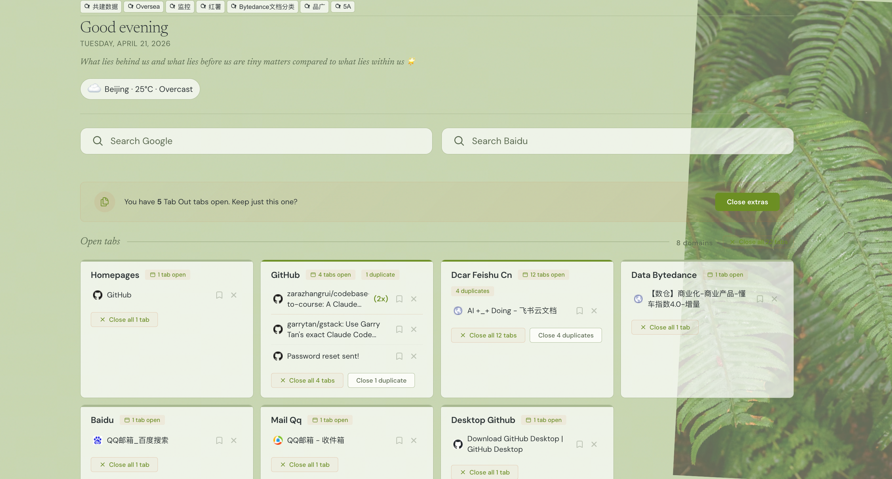

# Tab Out Enhanced

**Keep tabs on your tabs with weather, bookmarks, search, and more!**

Tab Out Enhanced is a beautiful Chrome extension that replaces your new tab page with a dashboard of everything you have open. Tabs are grouped by domain, with homepages (Gmail, X, LinkedIn, etc.) pulled into their own group. Close tabs with a satisfying swoosh + confetti. Enhanced with weather, bookmarks, search, and beautiful UI!

---

## ✨ Features

### Core Features
- **See all your tabs at a glance** on a clean grid, grouped by domain
- **Homepages group** pulls Gmail inbox, X home, YouTube, LinkedIn, GitHub homepages into one card
- **Close tabs with style** with swoosh sound + confetti burst
- **Duplicate detection** flags when you have the same page open twice, with one-click cleanup
- **Click any tab to jump to it** across windows, no new tab opened
- **Save for later** bookmark tabs to a checklist before closing them
- **Localhost grouping** shows port numbers next to each tab so you can tell your vibe coding projects apart
- **Expandable groups** show the first 8 tabs with a clickable "+N more"
- **100% local** your data never leaves your machine
- **Pure Chrome extension** no server, no Node.js, no npm, no setup beyond loading the extension

### Enhanced Features (Enhanced)
- 🌤️ **Real-time Weather** - Shows Beijing weather with cute emojis (no location permission needed!)
- 📚 **Chrome Bookmarks** - Display your bookmarks at the top, with folder support and drag-to-reorder
- 🔍 **Google & Baidu Search** - Dual search bars for quick searching
- 🌿 **Beautiful Background** - Green plant leaf decoration for a fresh look
- 🌙 **Dark Mode** - Eye-friendly dark theme
- 🎆 **Spectacular Fireworks** - Enhanced confetti effects when closing tabs
- 🎉 **Festival Reminders** - Automatic festival detection with cute animations
- 🧮 **Tab Statistics** - Real-time stats showing domains, open tabs, and selected tabs
- ✅ **Batch Operations** - Select all tabs, close selected tabs in bulk
- 🌐 **Multi-browser Support** - Compatible with Chrome, Edge, Brave, and **Doubao Browser** (豆包浏览器)!
- 🎯 **Smart Domain Grouping** - Friendly domain names (豆包, GitHub, YouTube, etc.)

---

## 📸 Screenshots



*Beautiful interface with bookmarks, weather, search, and tab management!*

### How to add your own screenshots:
1. Open a new tab in Chrome to see Tab Out Enhanced
2. Take a screenshot (Mac: `Cmd + Shift + 4`; Windows: `Win + Shift + S`)
3. Save the screenshot as `screenshots/screenshot.png`
4. Add more screenshots to the `screenshots/` folder and update this README!


---

## 🚀 Manual Setup

**1. Clone the repo**

```bash
git clone <your-repo-url.git
```

**2. Load the extension**

### For Chrome / Edge / Brave:
1. Open browser and go to `chrome://extensions`
2. Enable **Developer mode** (top-right toggle)
3. Click **Load unpacked**
4. Navigate to the `extension/` folder inside the cloned repo and select it

### For Doubao Browser (豆包浏览器):
1. Open Doubao Browser and go to `chrome://extensions` (or `doubao://extensions`)
2. Enable **Developer mode** (top-right toggle)
3. Click **Load unpacked**
4. Navigate to the `extension/` folder inside the cloned repo and select it

**3. Open a new tab**

You'll see Tab Out.

---

## 📖 How it works

```
You open a new tab
  -> Tab Out shows your open tabs grouped by domain
  -> Homepages (Gmail, X, 豆包, etc.) get their own group at the top
  -> Real-time Beijing weather and festival info displayed
  -> Your Chrome bookmarks at the top (drag to reorder!)
  -> Google + Baidu search bars for quick searching
  -> View tab statistics (domains, open tabs, selected)
  -> Batch select and close multiple tabs
  -> Click any tab title to jump to it
  -> Close groups you're done with (swoosh + spectacular fireworks!)
  -> Save tabs for later before closing them
```

Everything runs inside the extension. Saved tabs are stored in `chrome.storage.local`. Weather data from wttr.in (free, no API key required, no location permission needed!).

---

## 📝 Changelog

### v2.0.0 (Latest)
- ✨ **Added Doubao Browser support** - 豆包浏览器完美兼容！
- 🚫 **Removed geolocation request** - No more popups, uses Beijing weather by default
- 🗑️ **Removed tab search box** - Cleaner interface
- 📊 **Added tab statistics** - Real-time stats for domains, open tabs, selected tabs
- ✅ **Enhanced batch operations** - Select all, close selected tabs in bulk
- 🎯 **Smart domain grouping** - Friendly Chinese domain names (豆包, GitHub, YouTube, etc.)
- 🎨 **Improved UI/UX** - Better spacing and visual hierarchy

### v1.x.x
- Initial enhanced version with weather, bookmarks, search, and beautiful UI

---

## 🛠️ Tech stack

| What | How |
|------|-----|
| Extension | Chrome Manifest V3 |
| Storage | chrome.storage.local |
| Sound | Web Audio API (synthesized, no files) |
| Animations | CSS transitions + JS confetti particles |
| Weather | wttr.in (free API) |

---

## 📄 License

MIT

---

## 🙏 Credits & Acknowledgements

### Standing on the Shoulders of Giants 🌟

This project builds upon the wonderful work of the original [Tab Out](https://github.com/zarazhangrui/tab-out) created by [Zara](https://x.com/zarazhangrui).

> "If I have seen further, it is by standing on the shoulders of giants."
> — Isaac Newton

**Original Project:**
- Creator: Zara Zhang
- Repository: https://github.com/zarazhangrui/tab-out
- Twitter: https://x.com/zarazhangrui

Thank you Zara for creating such a beautiful and useful project! Standing on your shoulders, I've been able to further enhance this extension with new features! 🙏❤️

---

Built by [ShanWangkaka](https://github.com/ShanWangkaka) with ❤️
